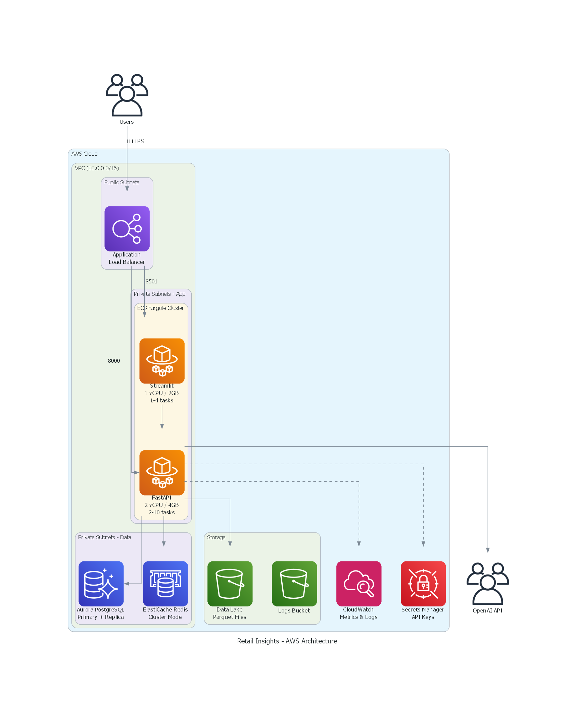
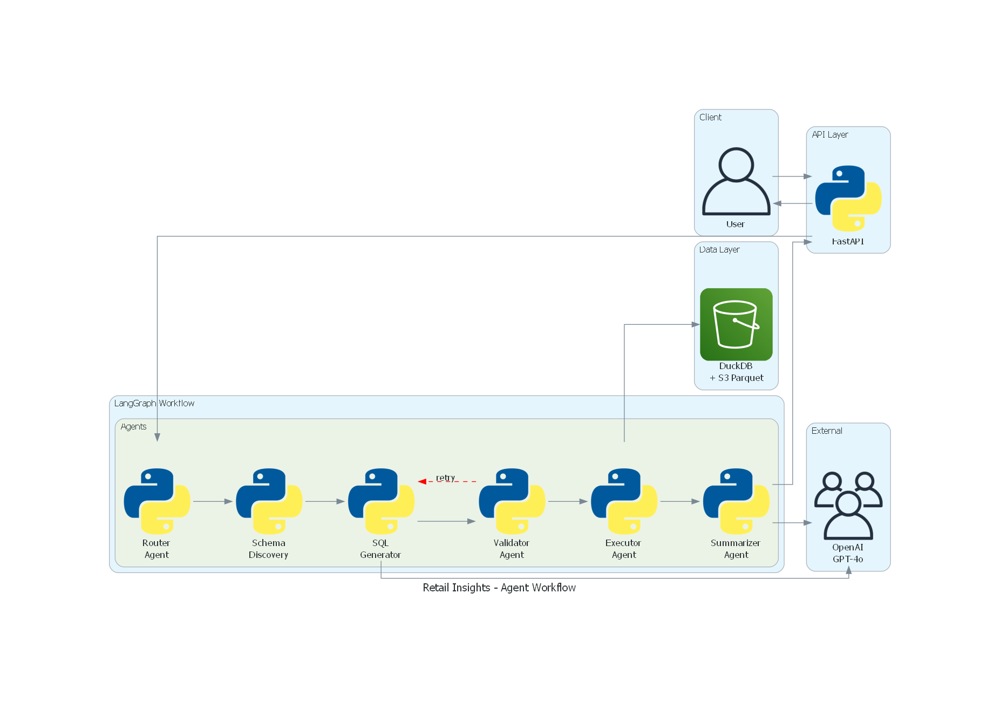

# Retail Insights Assistant

A production-ready multi-agent system for natural language querying of retail sales data, powered by LangGraph and DuckDB.

[](https://www.python.org/downloads/)
[](https://opensource.org/licenses/MIT)
[](https://github.com/astral-sh/ruff)
[](https://mypy-lang.org/)

---

## Overview

The Retail Insights Assistant enables business users to query large-scale sales data using natural language. The system translates questions into SQL, executes them against analytical data stores, and returns human-readable insights.

**Key Capabilities:**

- Natural language to SQL translation with schema awareness
- Multi-agent workflow with validation and retry logic
- Support for 100GB+ analytical datasets via DuckDB
- Conversational Q&A and automated summarization modes
- Production-ready with authentication, rate limiting, and observability

---

## Table of Contents

- [Architecture](#architecture)
- [Getting Started](#getting-started)
- [Configuration](#configuration)
- [Project Structure](#project-structure)
- [Documentation](#documentation)
- [Development](#development)
- [Deployment](#deployment)
- [License](#license)

---

## Architecture

The system implements a multi-agent architecture using LangGraph for orchestration:



**Agent Workflow:**



**Technology Stack:**

| Layer | Technology | Purpose |
|-------|------------|---------|
| Frontend | Streamlit | Interactive chat interface |
| API | FastAPI | REST endpoints with authentication |
| Orchestration | LangGraph | Multi-agent workflow management |
| LLM | OpenAI GPT-4o | Query understanding and generation |
| Data Engine | DuckDB | Analytical query execution |
| Storage | S3 Parquet | Scalable data lake |
| Checkpointing | Redis / PostgreSQL | Conversation state persistence |
| Infrastructure | Terraform + AWS | Production deployment |

For detailed architecture documentation, see:
- [High-Level Design (HLD)](docs/architecture/HLD.md)
- [Low-Level Design (LLD)](docs/architecture/LLD.md)

---

## Getting Started

### Prerequisites

- Python 3.12 or higher
- [uv](https://docs.astral.sh/uv/) package manager (recommended)
- Docker and Docker Compose
- OpenAI API key

### Installation

```bash
# Clone the repository
git clone https://github.com/s1v4-d/nlsql-mas.git
cd nlsql-mas

# Install dependencies
uv sync

# Copy environment configuration
cp env-files/secrets/secrets.env.example env-files/secrets/secrets.env
```

Configure the following in `env-files/secrets/secrets.env`:

```bash
OPENAI_API_KEY=sk-...
ADMIN_API_KEY=your-admin-key
USER_API_KEY=your-user-key
```

### Running Locally

```bash
# Start all services (API, UI, Redis, PostgreSQL)
make start

# Access the application
# API:        http://localhost:8000
# Streamlit:  http://localhost:8501
# API Docs:   http://localhost:8000/docs
```

### Running Tests

```bash
# Run all tests
make test

# Run with coverage report
make test-cov

# Run specific test categories
uv run pytest -m unit
uv run pytest -m integration
uv run pytest -m e2e
```

---

## Configuration

### Environment Variables

| Variable | Description | Default |
|----------|-------------|---------|
| `OPENAI_API_KEY` | OpenAI API key | Required |
| `OPENAI_MODEL` | Model for agents | `gpt-4o` |
| `DATABASE_URL` | PostgreSQL connection string | `postgresql://...` |
| `REDIS_URL` | Redis connection string | `redis://localhost:6379` |
| `LOCAL_DATA_PATH` | Path to local Parquet files | `./data/Sales Dataset` |
| `S3_DATA_PATH` | S3 path for production data | `s3://bucket/data` |
| `RATE_LIMIT_ENABLED` | Enable API rate limiting | `true` |
| `RATE_LIMIT_QUERY` | Query endpoint limit | `30/minute` |
| `LOG_LEVEL` | Logging verbosity | `INFO` |

### Authentication

The API supports two authentication scopes:

| Scope | Header | Access |
|-------|--------|--------|
| User | `X-API-Key: <USER_API_KEY>` | Query and summarize endpoints |
| Admin | `X-API-Key: <ADMIN_API_KEY>` | All endpoints including schema management |

---

## Project Structure

```
nlsql-mas/
├── src/retail_insights/        # Application source code
│   ├── api/                    # FastAPI routes and middleware
│   ├── agents/                 # LangGraph multi-agent system
│   │   ├── nodes/              # Agent implementations
│   │   ├── prompts/            # LLM prompt templates
│   │   ├── graph.py            # Workflow graph builder
│   │   └── state.py            # Agent state schema
│   ├── engine/                 # DuckDB data layer
│   ├── models/                 # Pydantic request/response schemas
│   ├── core/                   # Configuration, logging, exceptions
│   └── ui/                     # Streamlit interface
├── tests/                      # Test suite (unit, integration, e2e)
├── docs/                       # Architecture and API documentation
├── infrastructure/             # Terraform modules for AWS
└── env-files/                  # Docker and environment configuration
```

---

## Documentation

| Document | Description |
|----------|-------------|
| [High-Level Design](docs/architecture/HLD.md) | System architecture and component overview |
| [Low-Level Design](docs/architecture/LLD.md) | Implementation details and code structure |
| [Schema Documentation](docs/schema_documentation.md) | Data model and table schemas |
| [Security Practices](docs/aws-security-best-practices.md) | AWS security configuration |
| [Observability](docs/observability/opentelemetry-research.md) | Monitoring and tracing setup |
| [API Reference](http://localhost:8000/docs) | OpenAPI documentation (runtime) |

---

## Development

### Code Quality

```bash
# Lint code
make lint

# Format code
make format

# Type checking
uv run mypy src/

# Run all checks
make check
```

### Commit Guidelines

This project follows [Conventional Commits](https://www.conventionalcommits.org/):

```
feat(agents): add schema discovery agent
fix(executor): handle timeout errors gracefully
docs(readme): update installation instructions
test(unit): add validator edge case tests
```

### Branch Naming

```
feat/feature-name
fix/issue-description
docs/documentation-update
refactor/component-name
```

---

## Deployment

### Docker

```bash
# Build production images
make build

# Run with Docker Compose
docker compose -f env-files/docker-compose.yml up
```

### AWS Infrastructure

The `infrastructure/` directory contains Terraform modules for:

- VPC and networking
- ECS Fargate services
- Aurora PostgreSQL
- ElastiCache Redis
- S3 data lake
- CloudWatch monitoring

```bash
cd infrastructure/environments/dev
terraform init
terraform plan
terraform apply
```

See [infrastructure/](infrastructure/) for detailed module documentation.

---

## License

This project is licensed under the MIT License. See [LICENSE](LICENSE) for details.

---

## Acknowledgments

- [LangGraph](https://github.com/langchain-ai/langgraph) - Multi-agent orchestration framework
- [DuckDB](https://duckdb.org/) - In-process analytical database
- [FastAPI](https://fastapi.tiangolo.com/) - High-performance API framework
- [Streamlit](https://streamlit.io/) - Data application framework
