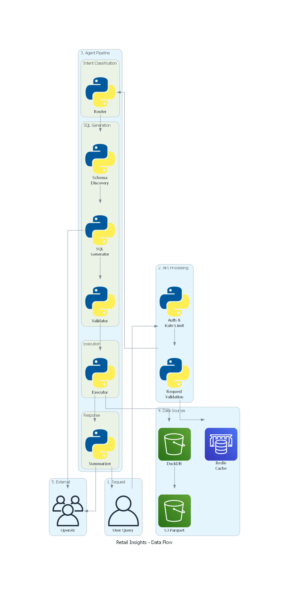
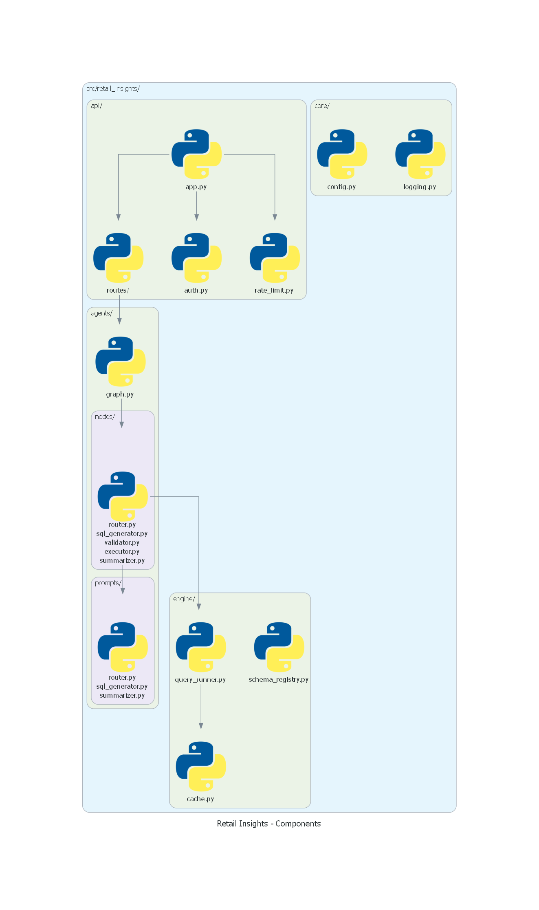
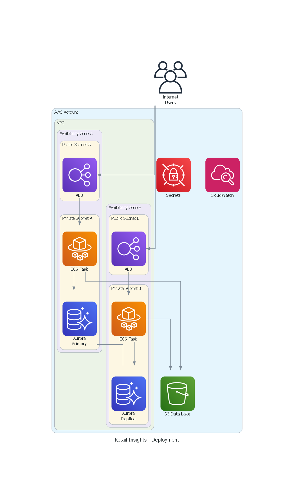

# Documentation

This directory contains the architecture, design, and reference documentation for the Retail Insights Assistant.

## Architecture

| Document | Description |
|----------|-------------|
| [HLD.md](architecture/HLD.md) | High-Level Design - System architecture, component overview, technology decisions |
| [LLD.md](architecture/LLD.md) | Low-Level Design - Implementation details, code structure, API specifications |

## Reference

| Document | Description |
|----------|-------------|
| [schema_documentation.md](schema_documentation.md) | Data model, table schemas, and column definitions |

## Architecture Diagrams

Visual diagrams for the system architecture, generated using [mingrammer/diagrams](https://github.com/mingrammer/diagrams):

### System Architecture

AWS deployment showing VPC, ECS Fargate, Aurora PostgreSQL, ElastiCache, and S3 data lake.

### Agent Workflow

LangGraph multi-agent pipeline showing the flow from Router through SQL generation, validation, execution, and summarization.

### Data Flow

End-to-end data flow from user query through API, agent pipeline, and data sources.

### Component Architecture

Code module structure showing package organization and dependencies.

### Deployment Architecture

Multi-AZ AWS deployment with load balancing and database replication.

## Quick Links

- [README](../README.md) - Project overview and getting started
- [CONTRIBUTING](../CONTRIBUTING.md) - Contribution guidelines
- [API Reference](http://localhost:8000/docs) - OpenAPI documentation (runtime)
